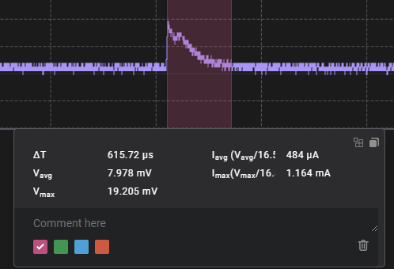

# AreaUnderCurve
An extension for Saleae Logic Analyser that determines the area under curve of an analog voltage measurement against 16.5 Ohm resistor to determine average current consumption

## Instructions
1. Install this extension by clicking "Install"
2. Add a measurement by clicking on the "Annotations panel" on the right, then the Measurements "+" icon.
3. Drag the measurement selection window over your recorded data.
